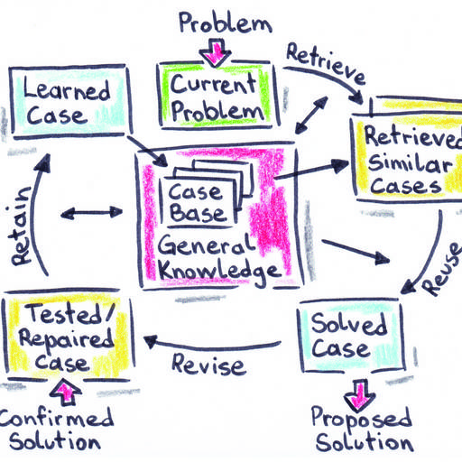
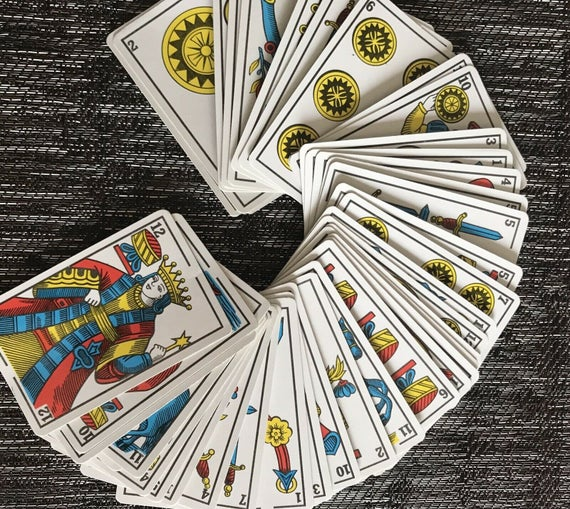

# AI Case-based reasoning's similarity calculation in Ttijari game ! 

In this repo, I implemented in the class "MainDeJeu" a similarity computation between Attijari's gambling hands, which is a very important step in the case-based reasoning in AI.

This reasoning method is a process of solving new problems based on the solutions of similar past problems. In Ttijary game, past problems are situations where we had to start with a certain type of cards, and we announced a winning score.


Attijari's game is a famous moroccan card game, where you have to announce and predict at the beggining of the game a specific score based on the first cards you get in your hand, in a way that at the end of the game you have to exceed the score you have declared at the beggining.

## Case-Based reasoning general model : 



To retrieve a case from the general knowledge, we must find the most similar case to the current case (which is 10 cards). 

The similarity computation is implementend using the static method : ```similariteMain.```

## Ttijari game : 


Ttijari game is an old moroccan game, where 4 players (2 each team) gets 10 cards each, and have to announce a score after distributing all the cards. 

After each player announce its own gambling score, the game starts and each player have to play and drop a card and collect some scores, where each color and number have a defined value (game details aren't important to compute similarity).

At the end of the game, each player announce his score, and if it exceeds the score he announced at the beginning of the game, he wins. If there's more than one player who predicted a score, the one with the highest one is the winner.

## Metrics : 

Different metrics are defined to compute the similarity between the actual cards and the cards in the case base, like similarities between card numbers, card colors, card values,...  

Text me if you need more details !
